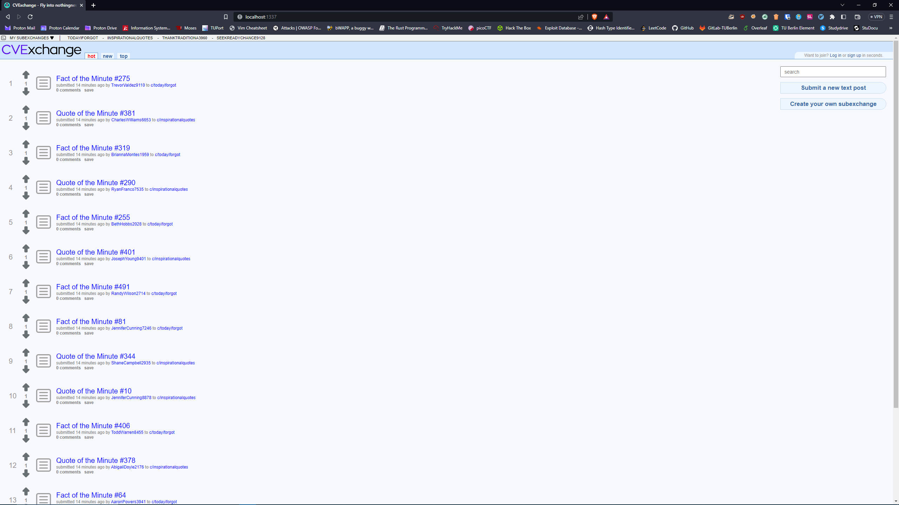

## The Service

-  CVExchange is a simple Reddit clone that does not have a surrogate for link posts and private messaging.
-  The backend of the application was built with Express.js, EJS, and a MySQL database.



## The Vulnerabilities

There are **three vulnerabilities** leading two **three flag stores**.

-  The **first flag store** is located in the users private file upload directory.
-  The **second flag store** can be found in the users personal note.
-  The **third flag store** is located in the users backup directory.

### Path Traversal to Private Upload Directory

The first vulnerability can be found inside of **app.js**.

```js
[...]
app.get(
   "/uploads/:userId/private/:filename",
   auth,
   fileAuth,
   async (req, res) => {
      try {
         const filepath = path.join(
            __dirname,
            "uploads",
            req.params.userId,
            "private",
            req.params.filename
         )
         await fs.promises.access(filepath)
         return res.sendFile(filepath)
      } catch (error) {
         console.error(error)
         return res.status(500).send("<h1>Internal Server Error</h1>")
      }
   }
)
[...]
app.use("/uploads", express.static("./uploads")) // <--- Vulnerable!
[...]
```

-  The webserver is serving the **uploads** directory statically due to the line `app.use("/uploads", express.static("./uploads"))`.
-  This is not secure, because while there is an authentication mechanism in place that forbids unauthorized users from accessing the URI: **/uploads/:userId/private/:filename**,
   users are still able to access that directory via the URI: **/uploads/:userId/public/../private/:filename**.

#### Reproducing the Exploit

./vid/path_traversal.mp4

In this example, we are exploiting the user with ID 151, which we received in the attack information.

1. Navigate to the victim's profile page via the URI: **/user/profile/151**.
2. Base64 encode the user ID to find out the name of the victim's upload directory: **MTUx**.
3. Access their private file via the URI: **/uploads/MTUx/public%2F..%2Fprivate/passwords.txt**

#### How to Mitigate

This vulnerability can be mitigated by deleting the line: `app.use("/uploads", express.static("./uploads")) `.

### Insecure Direct Object Reference on User Profiles

The second vulnerability can be found inside of **views/layouts/profile.ejs**.

```ejs
[...]
<div class="self-note">
  <% if ( parseInt(req.userId) === parseInt(req.params.id) ||
          parseInt(req.query.userId) === parseInt(req.params.id) ) { %> // <--- Vulnerable!
  <label for="note"> Note to Self: </label>
  <div id="note-text" class="note-wrap">
    <p name="note"><%= user.note %></p>
  </div>
  <% } %> <% if ( parseInt(req.userId) === parseInt(user.id) ) {
          %>
  <form class="note-edit-textarea" id="note-edit" style="display: none" method="post" action="/user/editnote">
    <textarea id="text" name="text" rows="7" cols="37"><%= user.note %></textarea><br />
    <input class="uploadbutton" type="submit" value="save" />
  </form>
  <button id="note-button" class="uploadbutton" onclick="editNote()">
    edit
  </button>
  <% } %>
</div>
[...]
```

-  The issue lies in the faulty conditional statement `if(parseInt(req.userId) === parseInt(req.params.id) || parseInt(req.userId) === parseInt(req.query.userId))`, used by the view engine to decide whether to display a users personal note.
-  The first part of that statement is fine, because `req.userId` is a parameter that is set by the authentication middleware and gets derived from decoding the users session cookie.
-  The problem is in the second part, which checks for the query parameter **userId**, which anyone can easily supply.
-  Therefore, it is possible to access a users private note through the following URI: **/user/profile/{victimId}?userId={victimId}**.

#### Reproducing the Exploit

./vid/idor.mp4

In this example, we are exploiting the user with ID 148, which we received in the attack information.

1. Navigate to the victim's profile page via the URI: **/user/profile/148**.
2. Access the victim's private note via the URI: **/user/profile/148?userId=148**.

#### How to Mitigate

A fix for this vulnerability would consist of rewriting the conditional statement as follows: `if(parseInt(req.userId) === parseInt(req.params.id))`.

### Remote Code Execution via Public File Uploads

The third vulnerability can be found inside of **routes/files.js**.

```js
[...]
const fileFilter = async (req, file, cb) => {
   try {
      const regex = /\.(jpg|jpeg|png)/i // <--- Vulnerable!
      if (
         (file.mimetype === "image/jpeg" || file.mimetype === "image/png") && // <--- Vulnerable!
         regex.test(file.originalname)
      ) {
         return cb(null, true)
      } else {
         return cb(new Error("Only image files are allowed"), false)
      }
   } catch (error) {
      return cb(error)
   }
}
[...]
```

-  The vulnerability lies in the conditions the server checks to determine whether a file upload is valid.
-  The first condition is, that the filename matches the regular expression `/\.(jpg|jpeg|png)/i`, which would also match a filename like **malicious.jpg.js**.
-  The second condition a file has to fulfill is that its MIME-Type should be either `image/jpeg` or `image/png`, which is achieved via the conditonal check `file.mimetype === 'image/jpeg || file.mimetype === image/png`.
-  If an attacker were to look through the source code of the `multer` module, which the server uses for file uploads, they would find out that `file.mimetype` is derived from the `Content-Type` field of the HTTP-Requests body.
-  Lastly, if an attacker were to upload malicious javascript code to their public upload directory and navigate to it, the server would execute that code and display the results to the attacker.

-  This is due to the following lines of code inside of **app.js**, where `magic` is a function that can be found in **middleware/other.js**, that is responsible for file integrity checks and achieves this with child-processes.

The route to the users public upload directory inside of **app.js**.

```js
[...]
app.get("/uploads/:userId/public/:filename", auth, async (req, res) => {
   try {
      const filepath = path.join(
         __dirname,
         "uploads",
         req.params.userId,
         "public",
         req.params.filename
      )
      await fs.promises.access(filepath)

      if (/\.(js)$/i.test(filepath)) {
         magic(filepath, req, res) // <--- Evaluation of uploaded file starts here!
      } else {
         return res.sendFile(filepath)
      }
   } catch (error) {
      console.error(error)
      return res.status(500).send("<h1>Internal Server Error</h1>")
   }
})
[...]
```

The **magic** function, which is defined inside of **middleware/other.js**.

```js
[...]
async function magic(filepath, req, res) {
   try {
      const { stdout, stderr } = await execFile("node", [filepath], {
         uid: 1001,
         gid: 1001,
         timeout: 3000,
      })
      return res.send(
         `<h1>stdout:</h1>&nbsp;${stdout} <br> <h1>stderr:</h1>&nbsp;${stderr}`
      )
   } catch (error) {
      console.error(error)
      return res.status(500).send("<h1>Internal Server Error</h1>")
   }
}
[...]
```

#### Reproducing the Exploit

./vid/rce.mp4

In this example, we are exploiting the user with ID 300, which we received in the attack information.

1. Navigate to the victim's profile page via the URI: **/user/profile/300**.
2. Base64 encode the user ID to find out the name of the victim's backup directory: **MzAw**.
3. Write code that will read the flag from the victim's backup directory and save it in a file named **malicious.jpg.js**.
4. Disable Javascript in your browser to bypass client-side file filters.
5. Upload the file **malicious.jpg.js** as your profile picture and intercept the request with Burpsuite.
6. Change the **Content-Type** field in the body of your HTTP request to **image/jpeg**.
7. Base64 encode your own user ID to find out the name of your upload directory: **MQ==**.
8. Navigate to the file you have uploaded via the URI: **/uploads/MQ==/public/malicious.jpg.js** to retrieve the flag.

#### How to Mitigate

The intended fix for this vulnerability would be to replace the regular expression in the file filter with the following: `/\.(jpg|jpeg|png)$/i`.
